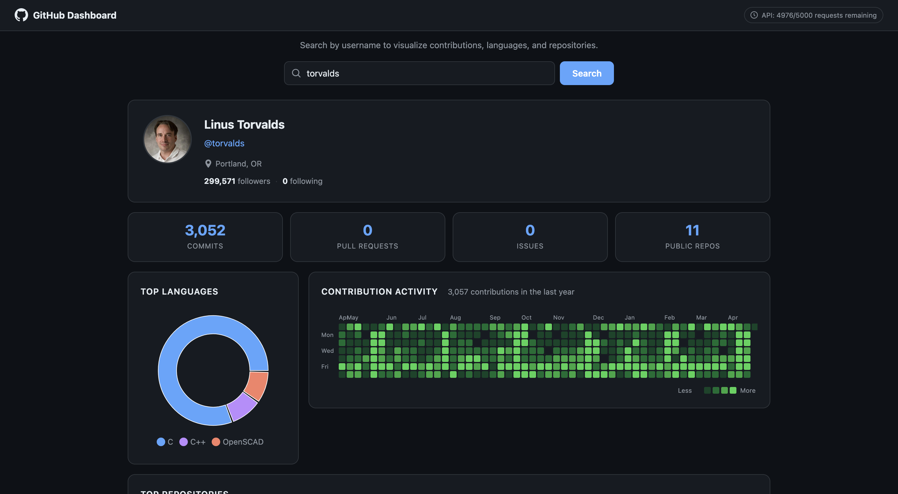

# GitHub Developer Dashboard

A React app that visualizes any GitHub user's contribution history, language breakdown, and top repositories using the GitHub REST and GraphQL APIs.



**Live:** https://dev-dashboard-eight-liart.vercel.app

---

## Features

- Profile card with avatar, bio, location, follower/following count
- Contribution heatmap (last 52 weeks, GitHub-style)
- Language breakdown donut chart (Recharts)
- Top 6 repositories sorted by stars
- Summary stats bar: commits, PRs, issues, repos
- Loading skeletons (no spinners)
- Dark/light mode via CSS variables (follows OS preference)
- Fully responsive — tested at 375px
- Rate limit indicator with friendly 403 error messages

---

## Local Setup

### 1. Clone

```bash
git clone https://github.com/B0OGI3/dev-dashboard.git
cd dev-dashboard
npm install
```

### 2. Create a GitHub Personal Access Token

Go to **GitHub → Settings → Developer settings → Personal access tokens → Tokens (classic)** and generate a token with the `read:user` scope.

### 3. Configure environment variables

```bash
cp .env.example .env
```

Edit `.env`:

```
VITE_GITHUB_CLIENT_ID=your_github_oauth_app_client_id
VITE_GITHUB_TOKEN=ghp_your_personal_access_token
```

> `VITE_GITHUB_TOKEN` is required for the GraphQL contribution graph. Without it, all REST API features still work (60 req/hr unauthenticated, 5000 req/hr authenticated).

### 4. Run

```bash
npm run dev
```

Open [http://localhost:5173](http://localhost:5173) and search any GitHub username.

---

## Deploy to Vercel

```bash
npm install -g vercel
vercel --prod
```

Set `VITE_GITHUB_TOKEN` and `VITE_GITHUB_CLIENT_ID` in your Vercel project's Environment Variables dashboard before deploying.

---

## Tech Stack

- [React 19](https://react.dev) + [Vite 6](https://vite.dev)
- [React Router 7](https://reactrouter.com)
- [Recharts](https://recharts.org) — language donut chart
- [Axios](https://axios-http.com) — REST API calls
- GitHub REST API v3 + GraphQL API v4
